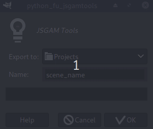
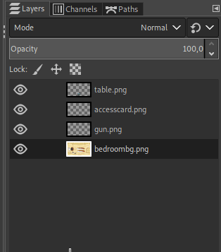

# Using JSGAM tools

This script helps to set up a JSGAM scene giving the position of the objects and paths for the walkable area and obstacles.

## Installation

Simply copy the jsgam_tools.py into the GIMP plug-ins folder.

- on Linux this is /home/YOU/.config/GIMP/2.10/plug-ins/
- on Windows this is C:\Users\your-name\Appdata\Roaming\GIMP\2.10\

You should find it under **File>Export to JSGAM...** after restarting GIMP.

Note that the .config and Appdata folders may be hidden.


## Usage

Set up your scene (background, objects and paths), go to File->Export to JSGAM and you should see the next window:



Choose the folder and a name for your file and click on OK.

## What's exported?

It exports the position of the layers (objects in the game) and the paths (the walkable area and the obstacles in the game).

**IMPORTANT:**

- The bottom layer **isn't** exported because the script takes it as the background.
- The bottom path is exported as **WalkArea** and the other paths are considered **Obstacles**.


```json
{
    "Objects": [
        {
            "Name": "Object_Name_Here",
            "Position": [
                475,
                539
            ],
            "Size": 123,
            "Texture": "table.png"
        },
        {
            "Name": "Object_Name_Here",
            "Position": [
                102,
                411
            ],
            "Size": 66,
            "Texture": "accesscard.png"
        },
        {
            "Name": "Object_Name_Here",
            "Position": [
                477,
                387
            ],
            "Size": 73,
            "Texture": "gun.png"
        }
    ],
    "Scenes": [
        {
            "Obstacles": {
                "Table": [
                    430,
                    508,
                    428,
                    493,
                    436,
                    482,
                    446,
                    470,
                    460,
                    454,
                    474,
                    450,
                    489,
                    451,
                    502,
                    458,
                    515,
                    475,
                    524,
                    488,
                    530,
                    500,
                    530,
                    513,
                    518,
                    520,
                    500,
                    528,
                    474,
                    530,
                    452,
                    528,
                    439,
                    518,
                    430,
                    508
                ]
            },
            "WalkArea": [
                430,
                508,
                428,
                493,
                436,
                482,
                446,
                470,
                460,
                454,
                474,
                450,
                489,
                451,
                502,
                458,
                515,
                475,
                524,
                488,
                530,
                500,
                530,
                513,
                518,
                520,
                500,
                528,
                474,
                530,
                452,
                528,
                439,
                518,
                430,
                508
            ]
        }
    ]
}
```
